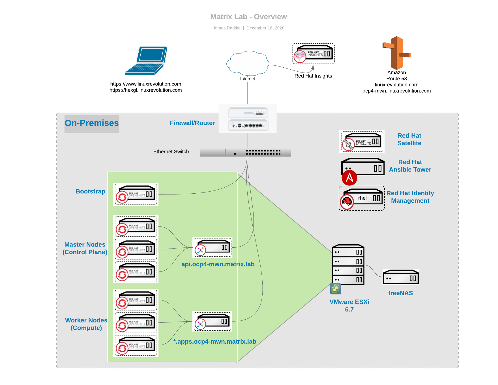
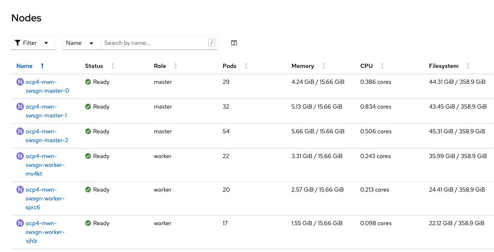

# OpenShift Container Platform 4


## Overview (topology)


## "Infrastructure Requirements"

### OCP and OCS Cluster
#### Phase (initial)
| Node              | Operating System  | vCPU | Virtual RAM | Storage | Qty        |   | vCPU | RAM | Storage |
|:------------------|:------------------|:----:|:------------|:--------|:-----------|:-:|------|:----|:------- |
| Bootstrap         | RHCOS             | 4    | 16 GB       | 120 GB  | 1          | - | 4    | 16  | 120     |
| Control plane     | RHCOS             | 4    | 16 GB       | 120 GB  | 3          | - | 12   | 48  | 360     |
| Compute (worker)  | RHCOS or RHEL 7.x | 2    | 8 GB        | 120 GB  | 3          | - | 6    | 24  | 360     |
|                   |                   |      |             |         | **totals** | = | 22   | 88  | 840     |

#### Phase (Day 2)
| Node              | Operating System  | vCPU | Virtual RAM | Storage | Storage (OCS) | Qty        |   | vCPU | RAM | Storage | Storage (OCS) |
|:------------------|:------------------|:----:|:------------|:--------|:-------------:|:-----------|:-:|-----|:-----|:------- |:--------------|
| Compute (Infra)   | RHCOS             | 4    | 16 GB       | 120 GB  | N/A           | 3          | - | 12   | 48  | 360     | N/A           |
| Compute (Storage) | RHCOS             | 8    | 24 GB       | 120 GB  | 512 GB        | 3          | - | 24   | 72  | 360 (*) | 1536          | 
|                   |                   |      |             |         |               | **totals** | = | 36   | 120 | 720     | 1536

(*)  This will depend on projected storage usage.  Keep in mind that OCS uses CEPH with 3x replication.  Meaning storage required is N * 3, where is N is the usable storage.  CEPH *does* use COW which can optimally utilize the storage.  
(Infra) - EFK stack  
(Storage) - OCS

#### Total Cluster Allocation 
|  Phase            | -                 | -     | -          | -       | -          | - | vCPU | RAM | Storage |
|:------------------|:------------------|:----:|:------------|:--------|:-----------|:-:|-----|:-----|:------- |
| Initial           |                   |      |             |         |            | = | 22   | 88  | 840     |
| Day 2             |                   |      |             |         |            | = | 36   | 120 | 2256    |
|                   |                   |      |             |         | **totals** | = | 58   | 208 | 3096    |


### ACM Cluster
| Machine       | Operating System  | vCPU | Virtual RAM | Storage | Qty        |   | vCPU | RAM | Storage 
|:--------------|:------------------|:----:|:------------|:--------|:-----------|:-:|------|:----|:-------
| Bootstrap     | RHCOS             | 4    | 16 GB       | 120 GB  | 1          | - | 4    | 16  | 120
| Control plane | RHCOS             | 4    | 16 GB       | 120 GB  | 3          | - | 12   | 48  | 360
| Compute       | RHCOS or RHEL 7.6 | 4    | 12 GB       | 120 GB  | 3          | - | 12   | 36  | 360
|               |                   |      |             |         | **totals** | = | 24   | 84  | 840
* Totals represents "steady-state" - therefore, the bootstrap system is not in the summary (aside from the disk allocated)

From the Install Docs
* Although these resources use 856 GB of storage, the bootstrap node is destroyed during the cluster installation process. A minimum of 800 GB of storage is required to use a standard cluster.

##  PreReq validation

### DNS Entries
```
nslookup api.ocp4-mwn.matrix.lab         # for the API to the control-plane
nslookup test.apps.ocp4-mwn.matrix.lab   # for the OCP "apps" such as grafana and the console
nslookup test.proles.ocp4-mwn.matrix.lab # for the F5 ingress for hosted apps
```

[Wikipedia - Proles](https://en.wikipedia.org/wiki/Proles_(Nineteen_Eighty-Four)) - "the proles are the working class of Oceania."  
I'll mix a little Orwell in with my Matrix theme.  

## Steady State
NOTE:  I had updated the machineset for the compute nodes before grabbing this output (normally they would only have 8GB memory)


## References
[Installing Bare Metal](https://docs.openshift.com/container-platform/4.5/installing/installing_bare_metal/installing-bare-metal.html#minimum-resource-requirements_installing-bare-metal) I struggled to find min requirememnts - this was the only place I found find any "hardware requirements"

[Installing vSphere Installer Provisioned - Cluster Resources](https://docs.openshift.com/container-platform/4.5/installing/installing_vsphere/installing-vsphere-installer-provisioned.html) Overview of "hardware requirements" as a total

[OCS Sizing Tool](https://sizer.ocs.ninja/)

[OCS - Infrastructure Requirements - Capacity Planning](https://access.redhat.com/documentation/en-us/red_hat_openshift_container_storage/4.6/html/planning_your_deployment/infrastructure-requirements_rhocs#capacity_planning)

