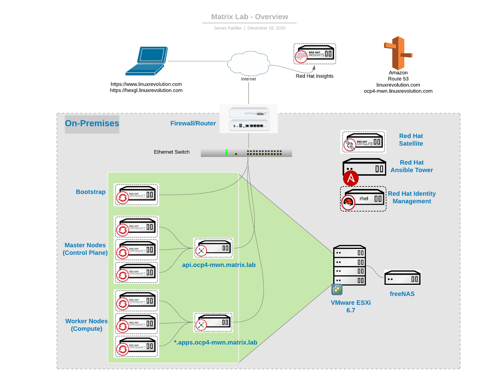
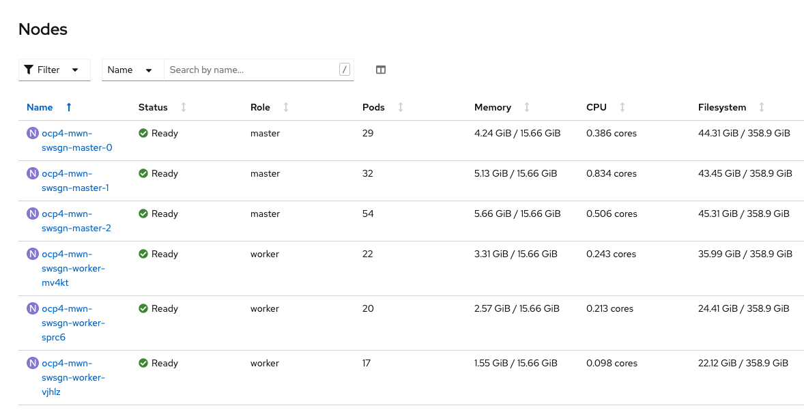

# OpenShift Container Platform 4

## Overview (topology)


## "Infrastructure Requirements"

* OpenShift Data Foundations (ODF - KFA, OCS)
* Logging
* Quay
* Red Hat Advanced Cluster Security (RHACS / ACS)

### OCP and ODF (fka OCS) Cluster
Some initial sizing calculations:
https://docs.openshift.com/container-platform/4.9/scalability_and_performance/recommended-host-practices.html

#### Phase (initial)
| Node      | Purpose       | Operating System  | vCPU | Virtual RAM | Storage | Qty        | - | vCPU | RAM | Storage |
|:----------|:--------------|:------------------|:----:|:------------|:--------|:-----------|:-:|------|:----|:------- |
| Bootstrap |               | RHCOS             | 4    | 16 GB       | 120 GB  | 1          | - | 4    | 16  | 120     |
| Master    | Control plane | RHCOS             | 4    | 16 GB       | 120 GB  | 3          | - | 12   | 48  | 360     |
| Worker    | (apps)        | RHCOS or RHEL 7.x | 2    | 8 GB        | 120 GB  | 3          | - | 6    | 24  | 360     |
|           |               |                   |      |             |         | **totals** | = | 22   | 88  | 840     |

From the Install Docs  
(*) Although these resources use 856 GB of storage, the bootstrap node is destroyed during the cluster installation process. A minimum of 800 GB of storage is required to use a standard cluster.

#### Phase (Day 2)
| Node             | Operating System  | vCPU | Virtual RAM | Storage | Storage (ODF) | Qty        | - | vCPU | RAM | Storage | Storage (ODF (fka OCS)) |
|:-----------------|:------------------|:----:|:------------|:--------|:-------------:|:-----------|:-:|-----|:-----|:------- |:--------------|
| Worker (Infra)   | RHCOS             | 4    | 16 GB       | 120 GB  | N/A           | 3          | - | 12   | 48  | 360     | N/A           |
| Worker (Storage) | RHCOS             | 10   | 24 GB       | 120 GB  | 512 GB        | 3          | - | 30   | 72  | 360 (*) | 1536          | 
|                  |                   |      |             |         |               | **totals** | = | 36   | 120 | 720     | 1536          |

(\*)  This will depend on projected storage usage.  Keep in mind that ODF (fka OCS) uses CEPH with 3x replication.  Meaning storage required is N * 3, where is N is the usable storage.  CEPH *does* use COW which can optimally utilize the storage.  
(Infra) - EFK stack  
(Storage) - ODF (fka OCS)

#### Total (Running Configuration)
| Node   | Purpose       | Operating System  | vCPU | Virtual RAM | Storage | Storage (ODF) | Qty        | vCPU | RAM | Storage | Storage (ODF (fka OCS)) |
|:-------|:--------------|:------------------|:----:|:------------|:--------|:-------------:|:-----------|:---:|:----:|:------- |:--------------|
| Master | control-plane | RHCOS             | 4    | 16 GB       | 120 GB  | N/A           | 3          | 12   | 48  | 360     | N/A           |
| Worker | Infra         | RHCOS             | 16   | 32 GB       | 120 GB  | N/A           | 3          | 48   | 96  | 360     | N/A           |
| Worker | Storage       | RHCOS             | 10   | 26 GB       | 120 GB  | 512 GB        | 3          | 30   | 78  | 360     | 1536          |
| Worker | Apps          | RHCOS             | 8    | 12 GB       | 120 GB  | N/A           | 3          | 24   | 36  | 360     |               |
|        |               |                   |      |             |         |               | **totals** | 114  | 258 | 1440    | 1536          |

### EC2 Instance Types (and sizing)
https://aws.amazon.com/ec2/instance-types/
| Instance Size | vCPU | Memory |
|:--------------|:----:|:------:|
| m5.large      | 2    | 8 |
| m5.xlarge     | 4    | 16 |
| m5.2xlarge    | 8    | 32 |
| m5.4xlarge    | 16   | 64 |

### ACM Cluster (stand-alone)
| Machine       | Operating System  | vCPU | Virtual RAM | Storage | Qty        |   | vCPU | RAM | Storage |
|:--------------|:------------------|:----:|:------------|:--------|:-----------|:-:|------|:----|:------- |
| Bootstrap     | RHCOS             | 4    | 16 GB       | 120 GB  | 1          | - | 4    | 16  | 120     |
| Control plane | RHCOS             | 4    | 16 GB       | 120 GB  | 3          | - | 12   | 48  | 360     |
| Worker        | RHCOS or RHEL 7.6 | 4    | 12 GB       | 120 GB  | 3          | - | 12   | 36  | 360     |
|               |                   |      |             |         | **totals** | = | 24   | 84  | 840     |

(\*) Totals represents "steady-state" - therefore, the bootstrap system is not in the summary (aside from the disk allocated)

### Shared Services Cluster (3-node cluster example)
| Machine            | Operating System  | vCPU | Virtual RAM | Storage | Qty        |   | vCPU | RAM | Storage 
|:-------------------|:------------------|:----:|:------------|:--------|:-----------|:-:|------|:----|:-------
| RH ACM (*)         | RHCOS             | 4    | 16 GB       | 120 GB  | 3          | - | 12   | 48  | 360 
| RH ACS - Central   | RHCOS             | 4    | 8 GB        | 120 GB  | 1          | - | 4    | 8   | 120 
| RH ACS - Scanner   | RHCOS             | 2    | 4 GB        | 120 GB  | 2          | - | 4    | 8   | 240 
| RH ACS - Collector(***) | RHCOS             | 1    | 1 GB        | 120 GB  | 3          | - | 3    | 3   | 240 
| RH Quay            | RHCOS             | 2    | 8 GB        | 120 GB  | 1          | - | 2    | 8   | 120 
| Logging(**)        | RHCOS             | 4    | 16 GB       | 120 GB  | 3          | - | 12   | 48  | 360 
| Monitoring(****)   | RHCOS             | 4    | 16 GB       | 120 GB  | 3          | - | 12   | 48  | 360 
|                    |                   |      |             |         | **totals** | = | 35   | 171 | 1200 

(\*) Only factoring for the worker node sizing for ACM (shared control-plane)  
(\*\*) Red Hat does not publish requirements for CPU/Mem for the Monitoring stack - EFK
(\*\*\*) Collector runs on ALL nodes, but we are only focused on this clusters resources
(\*\*\*\*) Prometheus, Alertmanager, Grafana

[RH ACM Install (Sizing)](https://access.redhat.com/documentation/en-us/red_hat_advanced_cluster_management_for_kubernetes/2.5/html-single/install/index)  
[RH ACS Sizing](https://docs.openshift.com/acs/3.69/installing/prerequisites.html#:~:text=Processor%20and%20memory%3A%202%20CPU,launch%20Central%20on%20such%20nodes.)  
[RH Quay Prerequisites](https://access.redhat.com/documentation/en-us/red_hat_quay/3.4/html/deploy_red_hat_quay_on_openshift_with_the_quay_operator/con-quay-openshift-prereq#:~:text=Resource%20Requirements%3A%20Each%20Red%20Hat,2000%20millicores%20of%20CPU.)  


## Label Strategy
Status: Work in Progress

| Type    | node-role     | secondary label(s) | 
|:--------|:--------------|:-------------------|
| Masters | master        |                    | 
| Worker  | worker        | app |
| infra   | infra,worker  | | 
| odf     | infra,worker  | |

##  PreReq validation

### DNS Entries
```
nslookup api.ocp4-mwn.matrix.lab         # for the API to the control-plane
nslookup test.apps.ocp4-mwn.matrix.lab   # for the OCP "apps" such as grafana and the console
nslookup test.proles.ocp4-mwn.matrix.lab # for the F5 ingress for hosted apps
```

[Wikipedia - Proles](https://en.wikipedia.org/wiki/Proles_(Nineteen_Eighty-Four)) - "the proles are the working class of Oceania."  
I'll mix a little Orwell in with my Matrix theme.  

## Steady State
NOTE:  I had updated the machineset for the compute nodes before grabbing this output (normally they would only have 8GB memory)


## References
[Installing Bare Metal](https://docs.openshift.com/container-platform/4.5/installing/installing_bare_metal/installing-bare-metal.html#minimum-resource-requirements_installing-bare-metal) I struggled to find min requirememnts - this was the only place I found find any "hardware requirements"

[Installing vSphere Installer Provisioned - Cluster Resources](https://docs.openshift.com/container-platform/4.5/installing/installing_vsphere/installing-vsphere-installer-provisioned.html) Overview of "hardware requirements" as a total

[OCS Sizing Tool](https://sizer.ocs.ninja/)
 
[OCS 4.6 - Infrastructure Requirements - Capacity Planning](https://access.redhat.com/documentation/en-us/red_hat_openshift_container_storage/4.6/html/planning_your_deployment/infrastructure-requirements_rhocs#capacity_planning)  

[ODF (fka OCS) 4.9 - Planning your Deployment](https://access.redhat.com/documentation/en-us/red_hat_openshift_data_foundation/4.9/html-single/planning_your_deployment/index)

[Red Hat Advanced Cluster Management for Kubernetes](https://access.redhat.com/documentation/en-us/red_hat_advanced_cluster_management_for_kubernetes/2.0/html-single/install/index)
