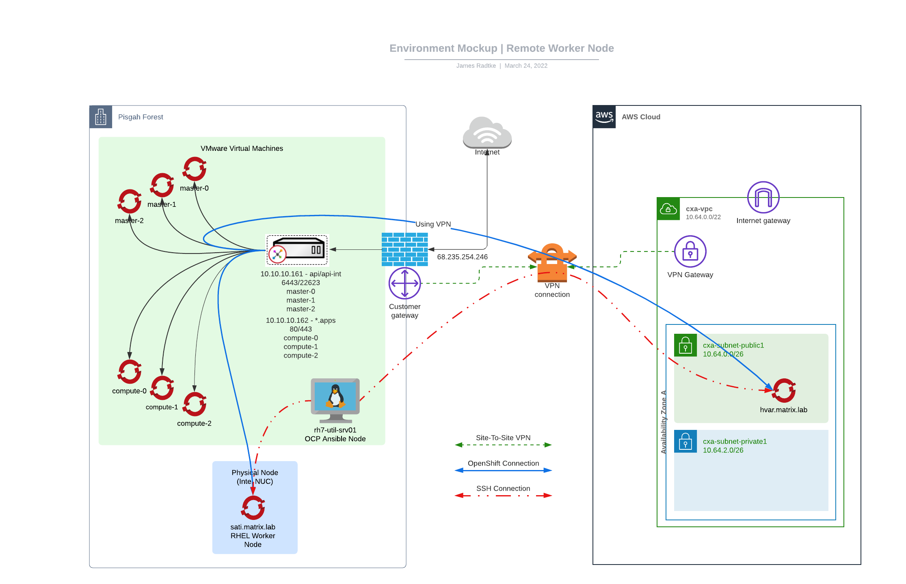

# Edge Remote RHEL Worker Node Demo

## Demo Environment Architecture

Architecture of this "demo environment"
* vSphere Cluster (for "control-plane" and "local" workers)
* UPI install (platform: none) hosted on VMware
* rolled my own "kicstart server" (PXE/BOOTP, TFTP, HTML) for installs and ignition configs
  * use kickstart server to install RHEL on Intel NUC (remote RHEL worker node)
* RHEL 7 node with Ansible to configure the RWN as a OCP Node
* Intel NUC RHEL 8 for "location=remote" node
* AWS EC2 RHEL 8 for "location=remote-aws" node



## Demo | Update webserver project
This project is a simple webserver, which has PHP enabled, allowing me to utilize the phpinfo() function - which happens to display the "Hostname:Port" (which is the "Pod IP")  
You can visit:  
https://www.linuxrevolution.com/phpinfo.php

### Show the current node layout (pointing out that "sati" is the RHEL node)
```
oc get nodes -o wide
oc get nodes -o wide | egrep -v 'compute|master'
```

## Show the network(s)
```
oc  get network.config/cluster -o jsonpath='{.spec.clusterNetwork},{"\n"}'
oc get hostsubnets
```

## Show the labels
NOTE: I have already added the label "location=remote" to my Remote RHEL Worker Node
```
oc get nodes --show-labels
```

## Label Remote Node
```
oc label node sati.matrix.lab location=remote
```

## Show Current Pod Placment
Switch to the project we will modify/udpate
```
NAMESPACE="linrevwelcomepage"
oc project $NAMESPACE
oc get pods -o wide
```

In a separate window, run:
```
while true; do curl --silent https://www.linuxrevolution.com/phpinfo.php | grep Hostname; sleep 1; done
```
then, run
```
oc scale deployment/wwwlinuxrevolutioncom --replicas=3
```

## Update Namespace
Add
    openshift.io/node-selector: location=remote

```
oc edit namespace $NAMESPACE
```

## recycle pods (migrate them to new node (sati.matrix.lab))
```
for POD in $(oc get pods | egrep -v 'NAME|build' | awk '{ print $1 }'); do oc get pods -o wide; oc delete pod $POD; sleep 10; done
```

## Add AWS RHEL Node (hvar.matrix.lab)
NOTE:  Node has already been added as a worker node to this cluster.  Also, I would probably find some tweaks to make this cleaner.

### Label the node (remote-aws)
```
oc label node hvar.matrix.lab location=remote-aws
```

### Update the Project (namespace)
Add
    openshift.io/node-selector: location=remote-aws

```
NAMESPACE=linrevwelcomepage
oc edit namespace $NAMESPACE
```

## recycle pods (migrate them to new AWS node (hvar.matrix.lab))
```
for POD in $(oc get pods -n $NAMESPACE | egrep -v 'NAME|build' | awk '{ print $1 }'); do oc get pods -o wide; oc delete pod $POD -n $NAMESPACE; sleep 10; done
```


# Notes
Need to determine exactly what Edge or Remote or Stretch-Cluster means

# Issues
* When I first began this challenge (Remote RHEL worker node), Nobody said "you can't do this" when I was asking questions.  My point:  I am not sure many folks are that experienced with this type of deployment, and I also people made assumptions of what is/was possible.  
* You CANNOT mix "cloud-provider" in a cluster (see previous note) - which I discovered by happenstance, AFTER attempting this a dozen times (and failing)
* DNS (it's *ALWAYS* DNS) - after deploying IPI in my lab for months (years?) I *thought* I had all of "those" prereqs nailed.  (I needed to add api-int)
* haproxy setup was a bit tricky (Needed "bind: tcp", not "bind: http" - which was counterintuitive for the type of traffic
* Some of the OpenShift Docs are wrong - and in a fairly nuanced way (i.e. project and namespace actually *aren't* the same thing)
* I fought the law... (I had some more nonsense mess with me - re: DNS, seriously... again...  it's ALWAYS DNS)


# References
These references were found when OCP 4.10 was the "latest"
* [Installing a cluster on any platform](https://docs.openshift.com/container-platform/4.10/installing/installing_platform_agnostic/installing-platform-agnostic.html)
* [Using remote worker nodes at the network edge](https://docs.openshift.com/container-platform/4.10/nodes/edge/nodes-edge-remote-workers.html) 
  * ``` "Note the following limitations when planning a cluster with remote worker nodes: OpenShift Container Platform does not support remote worker nodes that use a different cloud provider than the on-premise cluster uses." ```
* [Creating project-wide node selectors | OCP docs](https://docs.openshift.com/container-platform/4.10/nodes/scheduling/nodes-scheduler-node-selectors.html#nodes-scheduler-node-selectors-project_nodes-scheduler-node-selectors)  
* [BugZilla for error in Doc | you cannot modify a project, you modify a namespace](https://github.com/openshift/openshift-docs/issues/43667)  


