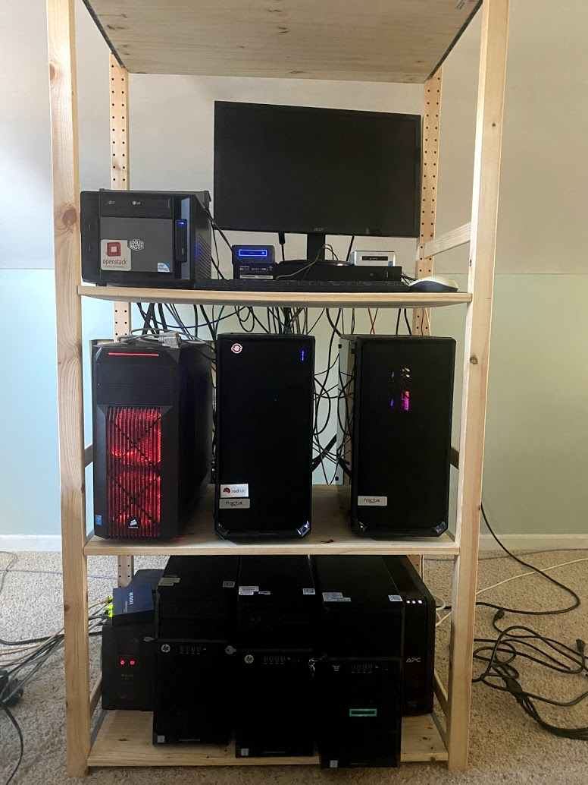

# Hardware - MATRIX.lab

## Purpose
Details of my Lab Hardware

Command to retrieve Manufacturer, Model, Proc, and Memory (on Linux hosts):
```
echo "| `hostname -s` | `dmidecode -s system-manufacturer` | `dmidecode -s baseboard-product-name` |`lscpu | grep "^Model name:" | grep -o -P '(?<=Intel\(R\)).*(?=\@)'`|`grep "cpu cores" /proc/cpuinfo | awk -F\: '{ print $2 }' | uniq` / `grep "cpu cores" /proc/cpuinfo 2>/dev/null |wc -l` | `free -h | grep "Mem:" | awk '{ print $2 }'` |"

```

## Hypervisor Environmnet (VMware)
| Hostname | Operating System         | Purpose      | Model, Proc, Mem Size                               | IP (public) | IP (storage) | Price (approx)
| :--------|:------------------------:|:-------------|:----------------------------------------------------|:-----------:|:------------:|:--------------|
| DOZER    | VMware ESX 6.7u3         | OCP lab      | Asus z490-e Core(TM) i9-10850K, 131G                | 10.10.10.14 | 172.16.10.14 | $1900
| TANK     | VMware ESX 6.7u3         | OCP lab      | Asus z490-e Core(TM) i9-10850K, 131G                | 10.10.10.15 | 172.16.10.15 | $1900
| APOC     | VMware ESX 6.7u3         | OCP lab      | Asus z490-e Core(TM) i9-10850K, 131G                | 10.10.10.18 | 172.16.10.18 | $1900
| SERAPH   | TrueNAS Core             | Storage Node | ASUS X99-PRO/USB 3.1, Xeon(R) CPU E5-2630 v3 , 94G  | 10.10.10.19 | 172.16.10.19 | $1800

## Physical View


## HARDWARE OVERVIEW
<pre>
                      +-----------------+
  SOPHOS XG UTG       |    MR FIREWALL  |
                      +-----------------+
                               |
                               |
                               |
                      +------- v--------+
      Cisco SG328     |    MR SWITCH    |
                      +-----------------+
                               |
                               |
                               |
                        +------v------+
                        |             |
                        |             |  RH8-UTIL-SRV01
                        |             |  (Bastion)
                        +-------------+


                       VMWARE VSPHERE 6.7
                            (OCP4)                        
       +-------------+  +------------+  +------------+
       |             |  |            |  |            |
       |    DOZER    |  |    TANK    |  |    APOC    |
       |             |  |            |  |            |
       +-------------+  +------------+  +------------+
              \\              //             //
             (iSCSI)       (iSCSI)       (iSCSI)
                \\          //            //
                +-\---------/------------/-+
                |                          |
                |         SERAPH           |
                |                          |
                +--------------------------+
                       TrueNAS Core

</pre>

## NUC Environment
### Lab Systems

| Hostname | Hardware Vendor         | baseboard  | CPU                    | Cores/Threads | Memory |
|:--------:|:-----------------------:|:----------:|:----------------------:|:------:|:----:|
| sati     | Intel Corporation       | NUC5i5RYB  | Core(TM) i5-5250U CPU  | 2 / 4  | 15Gi | 
| tbd      | Intel Corporation       | NUC7i7BNB  | Core(TM) i7-7567U CPU  | 2 / 4  | 31Gi |
| rama     | Intel(R) Client Systems | NUC10i7FNB | Core(TM) i7-10710U CPU | 6 / 12 | 62Gi |

### Internal Systems 
| Hostname | Hardware Vendor | baseboard | CPU | Cores/Threads | Memory |
|:--------:|:-----------------------:|:----------:|:----------------------:|:------:|:----:|
| nexus | Intel Corporation | D54250WYK | Core(TM) i5-4250U CPU | 2 / 4 | 15Gi | 


## Network Gear

